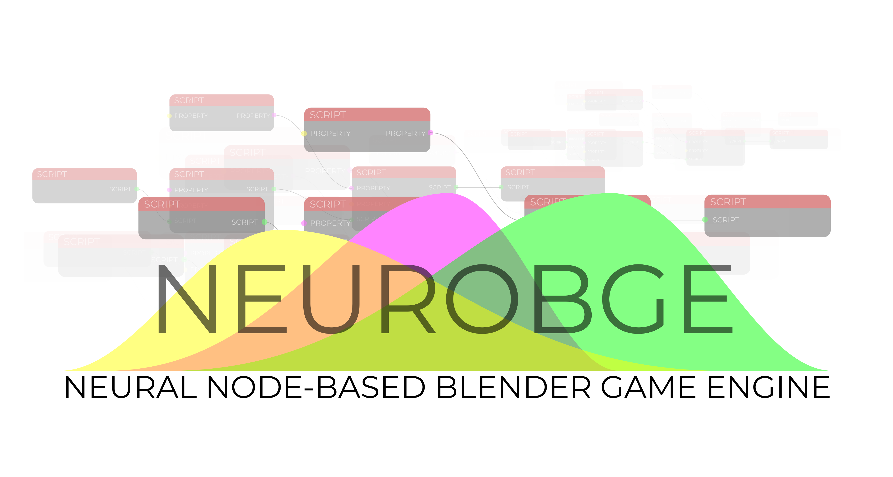
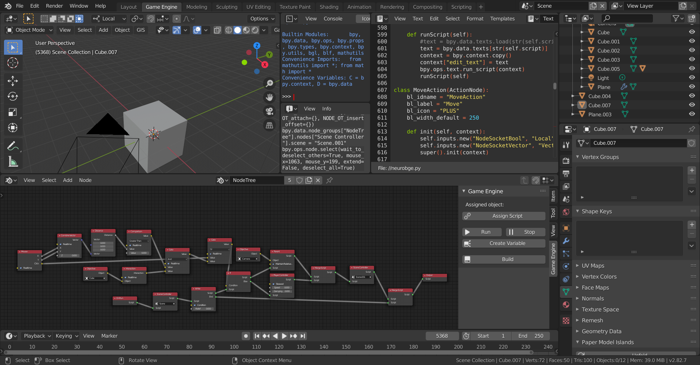

# NeuroBGE

#### A node-based Blender game engine and logic editor addon for Blender
##

##
Create games using a node-based logic editor and other incorporated features and functionalities
## Installation
Clone or download this repository and install the addon in Blender with `Preferences > Addons > Install` and enable the addon.
## Functionalities
- Logic editor
- Scripting capabilities
- Game engine
- Build functions for supported platforms (Mac OSX*; Windows; Linux*)
- Over forty-five nodes to develop stable games
## Build
*Notice:* to build on Blender
## TODO
- [x] Build support
- [x] XR support
  - [x] XR build support

*Untested
