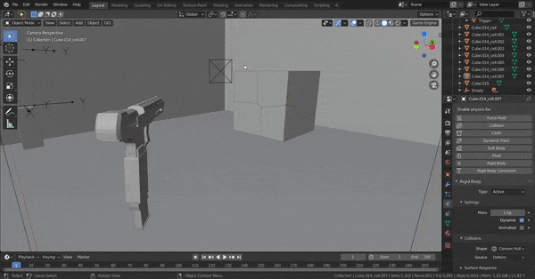

# NeuroBGE
> Node-based Blender game engine and logic editor addon for Blender

## [Wiki](https://github.com/underpig1/neuro-bge/wiki) | [Quickstart Guide](https://github.com/underpig1/neuro-bge/wiki/Quickstart-Guide) | [FPS Tutorial](https://www.youtube.com/watch?v=F63lMZXwCV8)

> Create games using a node-based logic editor and other incorporated features and functionalities, no scripting required.
## Installation
Clone or [download](https://github.com/underpig1/neuro-bge/archive/master.zip) this repository and install the addon in Blender
## Features
- Logic editor
- Scripting
- Game engine
- Build support on macOS, Windows, and Linux
- Multiplayer support
- Over fifty nodes to develop stable games

## Screenshots and Examples

